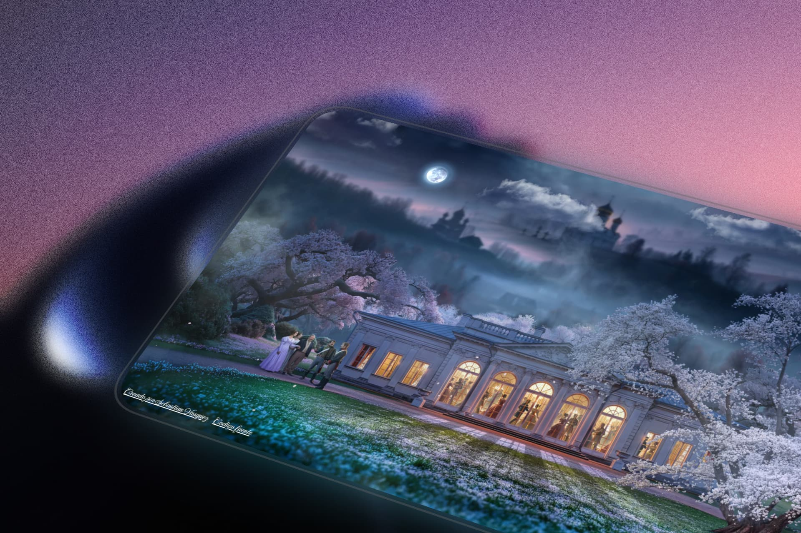

<h1 align="center">Alfoart Clone</h1>

<p align="center">
  
</p>

An interactive replica of the **"Derion Zini"** section from [Alfoart.com](https://alfoart.com/derionzini-en/), built with React, TypeScript, and Tailwind CSS.

This project was created as a personal practice exercise to improve skills in UX/UI animations, parallax effects, and immersive web experiences.

---

## About

This clone recreates the visual experience of the original Alfoart page, focusing on smooth animations, depth through parallax layers, and an atmospheric feel. The goal was to practice and refine front-end techniques such as:

- Multi-layered parallax with mouse tracking
- CSS keyframe animations for natural movement
- Audio integration with fade transitions
- Loading screen with blur entrance effects
- Responsive design for different screen sizes

## Inspiration

The original design that inspired this project:

**[alfoart.com/derionzini-en/](https://alfoart.com/derionzini-en/)**

All original visual design credits belong to **Alfoart**.

## Features

- **Parallax Effect** with mouse cursor tracking across multiple depth layers
- **Custom CSS Animations**: floating clouds, falling petals, sliding fog, dancing figures
- **Infinite Audio Loop** with fade in/fade out transitions
- **Loading Screen** with blur entrance animation
- **Responsive Design** optimized for screens ≤800px
- **Custom Favicon** with a sparkle emoji

## Technologies

| Technology | Version |
|------------|---------|
| React | 19.1.0 |
| TypeScript | 5.8.3 |
| Tailwind CSS | 4.1.8 |
| Vite | 6.3.5 |

## Getting Started

```bash
# Clone the repository
git clone https://github.com/sebastianvasquezechavarria1234/alfoart-clone.git

# Navigate to the project directory
cd alfoart-clone

# Install dependencies
npm install

# Start the development server
npm run dev
```

## Scripts

| Command | Description |
|---------|-------------|
| `npm run dev` | Starts the development server |
| `npm run build` | Generates the production build |
| `npm run preview` | Preview the production build |

## Project Structure

```
alfoart-clone/
├── public/
├── src/
│   ├── assets/
│   │   ├── background-1.jpg
│   │   ├── background-2.webp
│   │   ├── building-interior.jpg
│   │   ├── cloud-1.webp
│   │   ├── cloud-2.webp
│   │   ├── cloud-3.webp
│   │   ├── cloud-4.webp
│   │   ├── dancing-people.webp
│   │   ├── fog-5.webp
│   │   ├── fog-content2.webp
│   │   ├── front-scene.webp
│   │   ├── moon.png
│   │   ├── petal.webp
│   │   └── audio.mp3
│   ├── App.tsx
│   ├── index.css
│   └── main.tsx
├── index.html
├── package.json
├── tsconfig.json
└── vite.config.ts
```

## Credits

- **Original Design**: [Alfoart](https://alfoart.com/derionzini-en/)
- **Music**: [@genieonthestrings on TikTok](https://www.tiktok.com/@genieonthestrings)

---

<p align="center">❤️ Made with love by <a href="https://sebas-dev.vercel.app/">Sebastian V</a></p>
